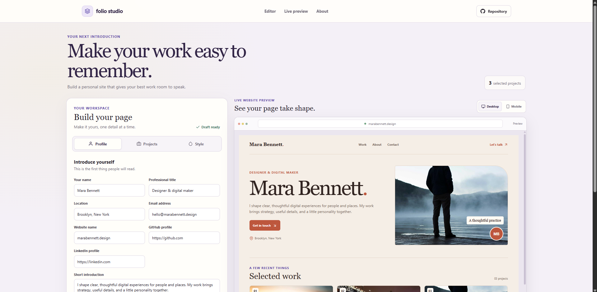

# Folio Studio

Folio Studio is a browser-based tool for building a personal portfolio website. Edit a profile, choose selected projects and a color theme, review a live desktop or mobile preview, and export the finished page as one HTML file.

## What the project includes

- A profile editor for name, professional title, location, email, website, GitHub, LinkedIn, and a short introduction.
- A project editor to add, edit, and remove work samples. Each project has a title, type, year, description, local cover image, and optional link.
- A custom confirmation dialog before removing a project. Cancel, Escape, or clicking outside the dialog keeps the project.
- Three visual themes: Warm clay, Garden violet, and Deep lagoon. The selected theme updates the live page and exported website.
- A live portfolio preview with desktop and mobile size controls.
- Automatic browser storage so the draft returns on the same browser and device.
- A standalone HTML export with the selected text, colors, and project images embedded in the downloaded file.
- Responsive navigation, a repository link in the header, and a floating Back to top button after scrolling more than 50px.

## How to use it

1. Edit the profile fields to set the name, title, location, contact information, social links, and introduction.
2. Open **Projects** to add a work sample, edit an existing one, or remove one after confirming.
3. Open **Style** and select a theme. The portfolio preview changes with the selected palette.
4. Use the **Desktop** and **Mobile** controls above the preview to check both page sizes.
5. Choose **Export website** to download a single HTML file. Open that file in a browser or share it as a complete page.

## Data and limits

The editor stores the draft in the browser's local storage under `folio-studio-portfolio`. The draft does not sync between browsers or devices, and there is no account or server storage. Clearing browser data removes the saved draft. The example projects and their cover images are included with the app. New projects can choose from those local cover images.

The exported file contains its project images, so it does not need the app to remain open. It is a static page. Future edits in Folio Studio do not change an export that was already downloaded.

## Run locally

Use Node.js and npm from this project folder:

```sh
npm install
npm run dev
```

Vite prints the local development address in the terminal.

## Check and preview

```sh
npm run lint
npm run build
npm run preview
```

ESLint checks the source. The production build is written to `dist`, and the preview command serves that build locally.

## Deploy

This project publishes to GitHub Pages from the `gh-pages` branch. The npm deploy command runs the production build first:

```sh
npm run deploy
```

**Website:** [https://a2rp.github.io/professional-portfolio-builder/](https://a2rp.github.io/professional-portfolio-builder/)

## Future improvements

These are ideas for later versions and are not implemented now:

- Let people upload their own profile and project images.
- Add more page layouts and allow sections to be reordered.
- Add import and export for a draft backup file.
- Add a hosted publishing option for the generated portfolio page.
- Add more detailed accessibility checks and content guidance.

## Links

- Portfolio: [https://www.ashishranjan.net](https://www.ashishranjan.net)
- GitHub: [https://github.com/a2rp](https://github.com/a2rp)
- CodePen: [https://codepen.io/ash1198](https://codepen.io/ash1198)
- LinkedIn: [https://www.linkedin.com/in/aashishranjan](https://www.linkedin.com/in/aashishranjan)
- Facebook: [https://www.facebook.com/theash.ashish/](https://www.facebook.com/theash.ashish/)
- YouTube: [https://www.youtube.com/@ashishranjan-ashz?sub_confirmation=1](https://www.youtube.com/@ashishranjan-ashz?sub_confirmation=1)
- Email: [mailto:ash.ranjan09@gmail.com](mailto:ash.ranjan09@gmail.com)

## Support

- Support: [https://a2rp-donation-page.netlify.app/](https://a2rp-donation-page.netlify.app/)
- Buy Me a Coffee: [https://buymeacoffee.com/ashishranjan](https://buymeacoffee.com/ashishranjan)
- Patreon: [https://www.patreon.com/ashishranjan](https://www.patreon.com/ashishranjan)
